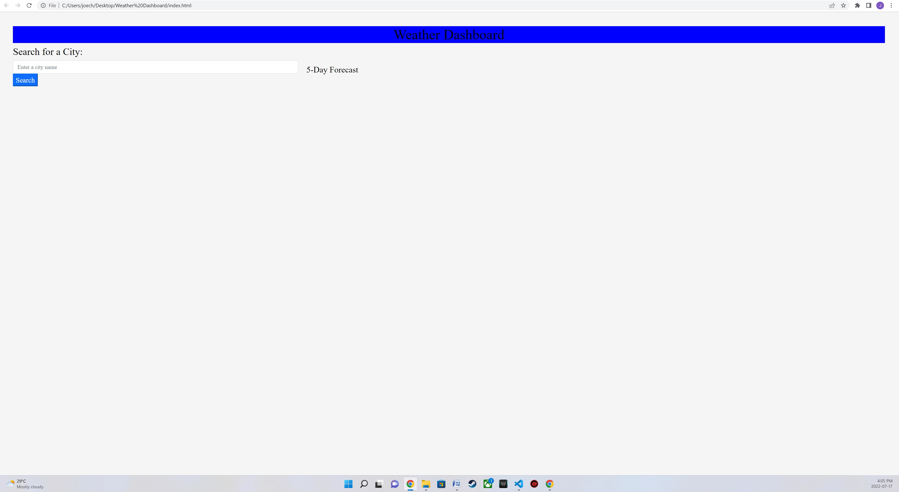
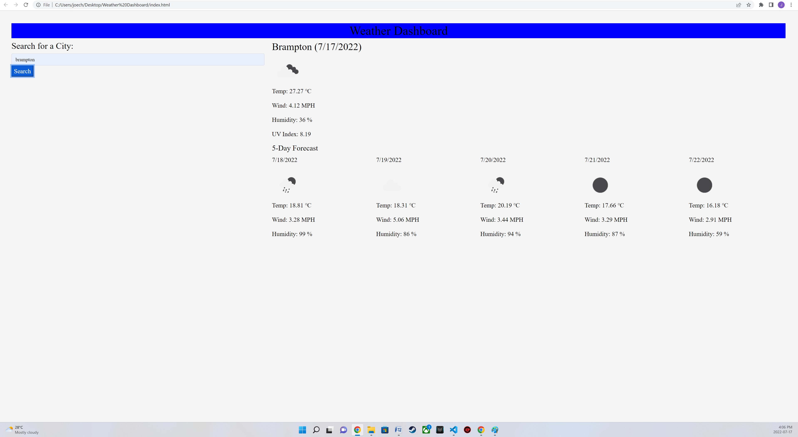

#  Server-Side APIs Challenge: Weather Dashboard

### Challenge 6 Server-Side APIs Challenge: Weather Dashboard

## Project Description
This project will allow the user to search for a city's current weather and 5 day forecast

## Installation
You can clone the project from GitHub by copying either HTTPS or SSH link or by downloading the project as a zip file
  

## Screenshot
![Screenshot]

## Contribution
Made by Joe Chaaya